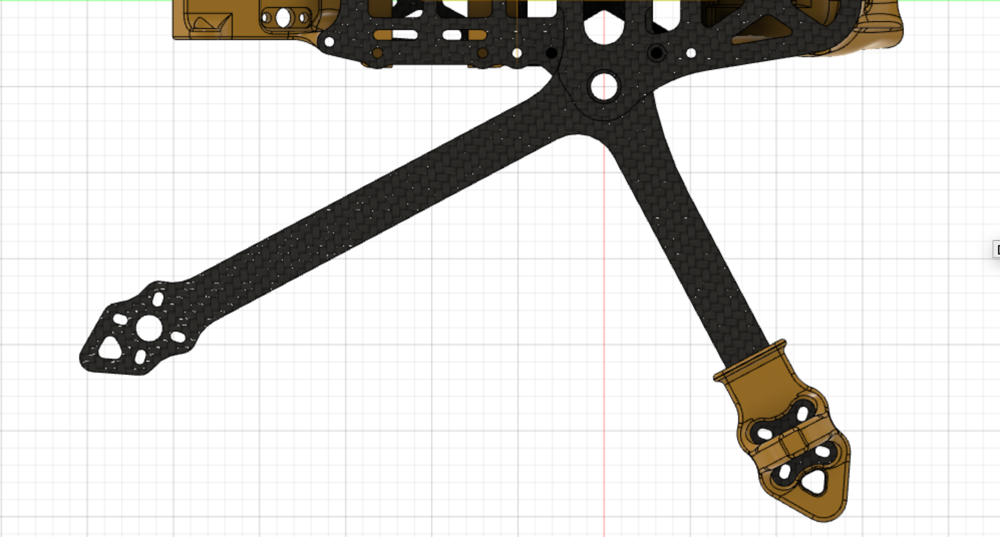

# MegaLongRange
The 7'' long range quadcopter frame with 3D printed accessories


## Additional hardware required
* Two (2) M3x28mm aluminium standoffs, external diameter 5mm
* Four (4) M3x20mm aluminium standoffs, external diameter 5mm
* Twelve (12) M3x8mm screws to secure the standoffs to carbon fiber plates
* Two (2) "double" chainring bolts (different size may be needed if you change any plate or arm thickness)
  * the bottom cylinder needs to be about 8mm tall, excluding the base
  * the top screw needs to be exactly 10mm tall, excluding the head

## Weight estimates
All carbon fiber parts plus hardware.

6mm arms: 137g
5mm arms: 117g
4mm arms: 97g

For canopy and antenna mount prints, add another 20-30g.


## Suggested parts that fit the 3D prints
* The canopy is designed for DJI FPV camera, so it would make sense to go with a DJI FPV Air Unit.
* If using a DJI FPV Air Unit, you'll need two (2) [TBS MMCX-to-SMA pigtails](https://www.team-blacksheep.com/products/prod:sma_mmcx9_pigtail) for the antenna mount.
* A [TBS Crossfire Diversity Nano RX](https://www.team-blacksheep.com/products/prod:xf_nano_div_rx) with two (2) [TBS Crossfire Immortal T antennas](https://www.team-blacksheep.com/products/prod:xf_immortal_t_v2_s) (See also [extended](https://www.team-blacksheep.com/products/prod:xf_immortal_t_v2_e) and [extra extended](https://www.team-blacksheep.com/products/prod:xf_immortal_t_v2_ee) versions).

## Custom Motor Mixes
Since this is a dead-cat frame, you might find it easier to use custom motor mixing to get your tune right. I did the math for you, so here goes.

This is what I have on my build, with reversed motors ("props out"):
```
mixer custom
mmix reset
mmix 0 1 -0.74 0.728 -1
mmix 1 1 -1 -0.728 1
mmix 2 1 0.74 0.728 1
mmix 3 1 1 -0.728 -1
```

## References
The design of this frame was inspired by, and it retains signature features from the [MiniLongRange 5'' by Dave_C](https://www.thingiverse.com/thing:4584851).
